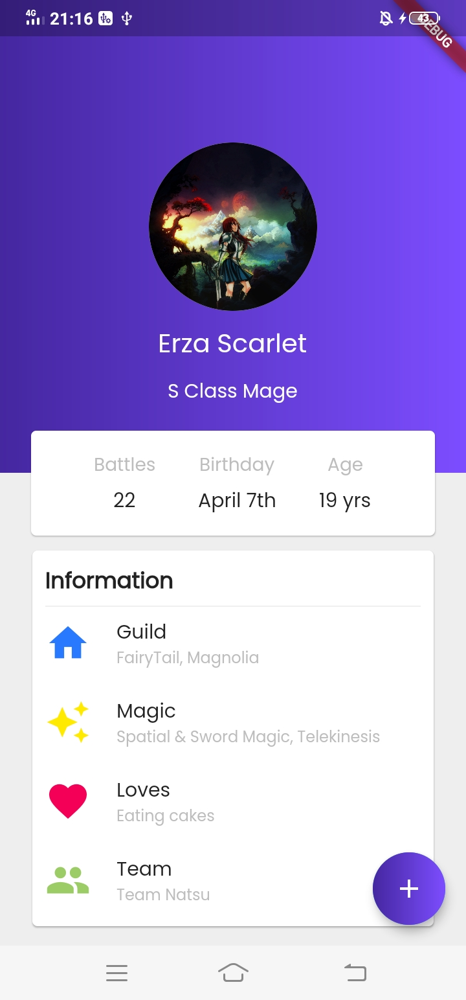

## Profile UI 👧

This is a simple Flutter Profile UI application. It shows the profile details of Erza Scarlet, one of my favourite anime characters from Fairy Tail :smile:. It uses <b>stateful</b> Profile widget where whenever the button is pressed, the count of the number of battles increases by one.

## Screenshot 📷
                              

## Getting Started

This project is a starting point for a Flutter application.

A few resources to get you started if this is your first Flutter project:

- [Lab: Write your first Flutter app](https://flutter.dev/docs/get-started/codelab)
- [Cookbook: Useful Flutter samples](https://flutter.dev/docs/cookbook)

For help getting started with Flutter, view our
[online documentation](https://flutter.dev/docs), which offers tutorials,
samples, guidance on mobile development, and a full API reference.
